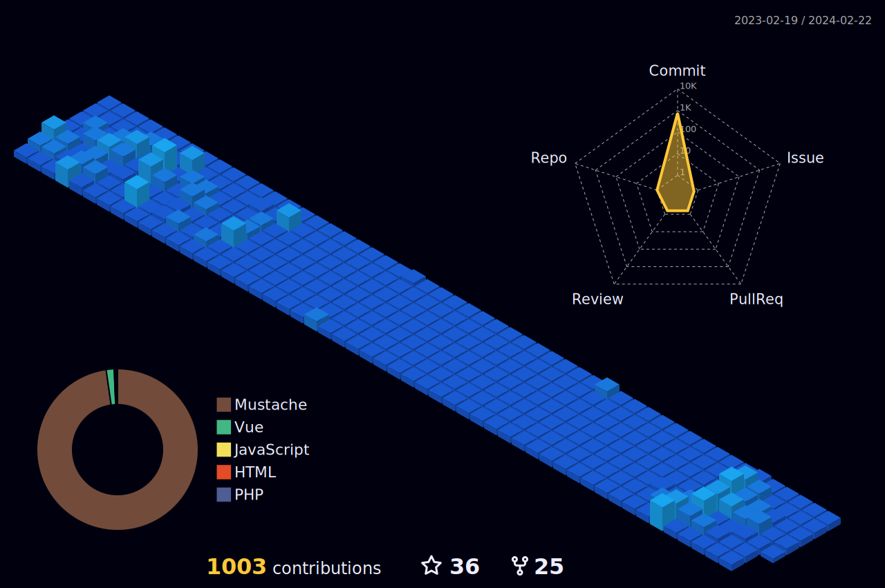

<!-- Social icons section -->
<h1 align="center"> Social Media: </h1>
  

    
    
    
  

</h1>

<!-- Description about me -->
<h2 align="center"> 🤔 About me 👨‍💻 </h2>

Eyyyy!!!  
I am <b>Fozlur Rahman,</b> better known as 'Shah'🕵🏼‍♂️  
I am from <strong>Dhaka, Bangladesh</strong> ☕☕  
I'm a guy who loves to develop new things 🖥️  
So... I am more than a robot coding 🤖, I am a real human trying to learn new things and develop incredible projects with ❤️ meeting incredible people on the way🚀 
If you are interested in a guy with a good vibe who loves knowledge and constant learning 📚, <b>⚙️I AM YOUR GUY⚙️</b>  
Contact me for new projects 📨, I am open to collaborate with you
  

<!-- Bogota's weather table -->

<h2 align="center"> Dhaka's Weather ⛅ </h2>
<table align="center" style="width:50%">
    <tr style="text-align:center">
        <th>Weather</th>
        <th>Temperature</th>
        <th>Sunrise</th>
        <th>Sunset</th>
        <th>Humidity</th>
    </tr>
    <tr style="text-align:center">
        <td><b>few clouds</b></td>
        <td><b>26°C</b></td>
        <td><b>06:10 AM</b></td>
        <td><b>06:10 PM</b></td>
        <td><b>72%</b></td>
    </tr>
</table>

### 🧐 More About Me:

<table style="border: none;">
  <tr style="border: none;">
    <td style="border: none;">
      <ul>
        <li>
          🔭 I have a Bachelor's degree in Computer Science and Engineering at the  American International University-Bangladesh
        </li>
        <li>
          🤝 I’m looking to collaborate on Open Source projects
        </li>
        <li>
          🌱 I’m currently learning React & NextJS; 
        </li>
        <li>
          👨🏻‍💻 Most of my projects are available on [Github](https://github.com/shahariaryan?tab=repositories)
        </li>
        <li>
          💬 Ask me about anything tech related, and I am happy to help (if you have questions about linux you can ask me🐧);
        </li>
        <li>
          📫 Feel free to contact me on [LinkedIn](https://www.linkedin.com/in/fozlur-rahman-98419a190/)
        </li>
        <li>
          🎷 When I am free, I like to play Video games 
        </li>
        <li>
          📝 Checkout my [Page](https://fozlur-dev.netlify.app/) 
        </li>
    </td>
    <td style="border: none;">
      
    </td>
  </tr>
</table>
   

<!-- languages and skills section -->

<h1 align="center"> Languages/Frameworks I'm good at: </h1>

<code></code>
<code></code>
<code></code>
<code></code>
<code></code>
<code></code>  
<code></code>
<code></code>

 

<h1 align="center"> Languages/Frameworks I'm learning: </h1>

  <code></code>
<code></code>
<code></code>
<code></code>
<code></code>

 

<h1 align="center"> Environments I work with: </h1>

<code></code>
<code></code>
<code></code>
<code></code>
<code></code>
<code></code>
<code></code>
  

 

<!-- GitHub stats section -->

## 📊 Github stats

<!-- Bassed on: https://github.com/anuraghazra/github-readme-stats -->

   
  
  
   
  <b>Note:</b> Top languages is only a metric of the languages my public code consists of and doesn't reflect experience or skill level.

<!-- Projects section -->

## 📘 My top open-source projects

<!-- Bassed on: Repo info cards - https://github.com/anuraghazra/github-readme-stats -->

  

    
    
  

    
&#8192;

  

    
    
  

&#8192;

&#8192;

  

<!-- last activity section -->

## Activity Graph

  

 

>
